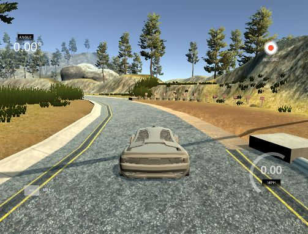
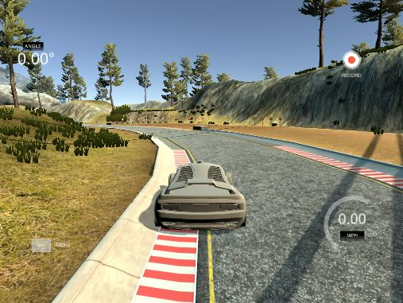
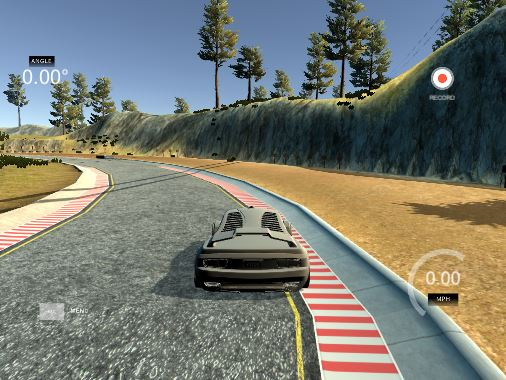
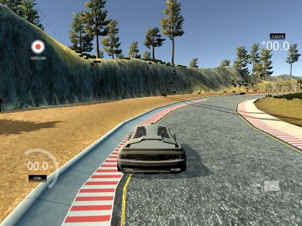
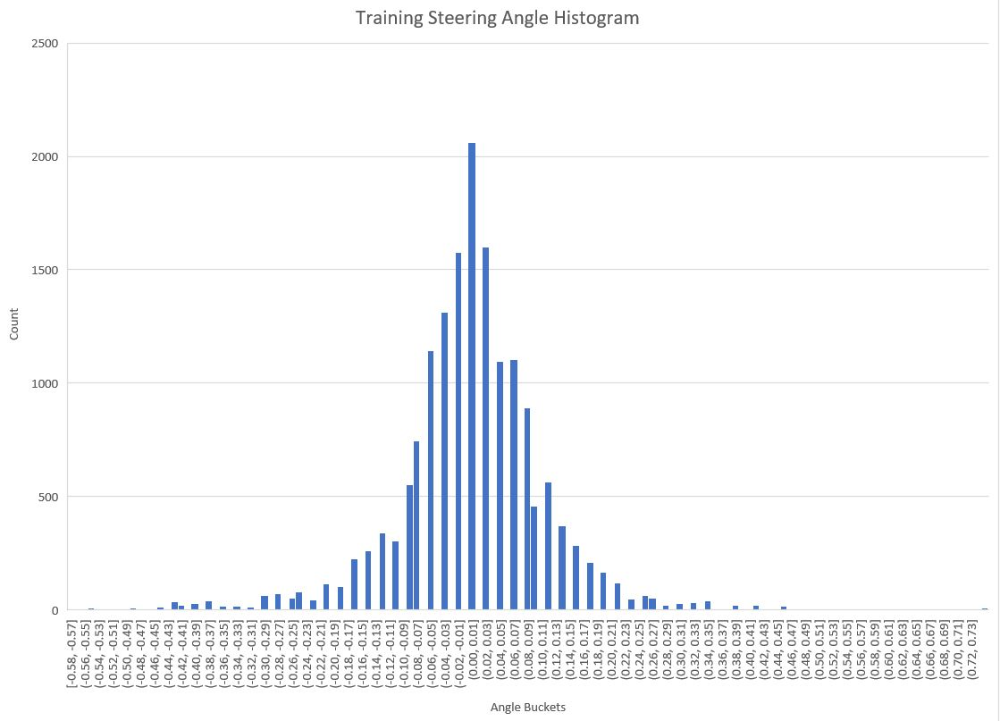
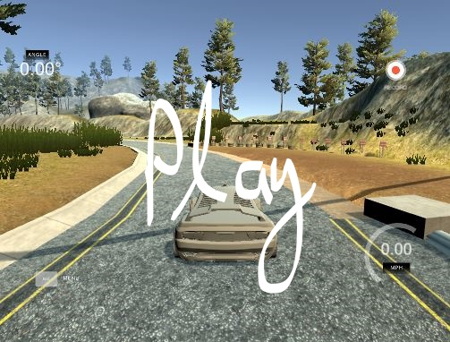

**Behavioral Cloning Project**

The goals / steps of this project are the following:
* Use the simulator to collect data of good driving behavior
* Build, a convolution neural network in Keras that predicts steering angles from images
* Train and validate the model with a training and validation set
* Test that the model successfully drives around track one without leaving the road
* Summarize the results with a written report

## Rubric Points

### Here I will consider the [rubric points](https://review.udacity.com/#!/rubrics/432/view) individually and describe how I addressed each point in my implementation.

---

### Files Submitted & Code Quality

#### 1. Submission includes all required files and can be used to run the simulator in autonomous mode

My project includes the following files:

* model.py containing the script to create and train the model
* drive.py for driving the car in autonomous mode
* model.h5 containing a trained convolution neural network based on the Nvidea pilotNet architecture
* writeup/writeup.md summarizing the results (this file)

#### 2. Submission includes functional code

Using the Udacity provided simulator and my drive.py file, the car can be driven autonomously around the track by executing 
```sh
python drive.py model.h5
```

#### 3. Submission code is usable and readable

The model.py file contains the code for training and saving the convolution neural network. The file shows the pipeline I used for training and validating the model, and it contains comments to explain how the code works.

### Model Architecture and Training Strategy

#### 1. An appropriate model architecture has been employed

My model consists of a convolution neural network with 3x3 and 5x5 filter sizes and depths between 24 and 64 (model.py lines 117-122).

The model includes RELU layers to introduce nonlinearity (code line 118), and the data is normalized in the model using a Keras lambda layer (code line 107 - 108).

#### 2. Attempts to reduce overfitting in the model

The model used early termination to reduce overfitting. I started training with 20 epochs and settled on using 7 epochs.

The model was trained and validated on different data sets to ensure that the model was not overfitting (code line 80). The model was tested by running it through the simulator and ensuring that the vehicle could stay on the track.

#### 3. Model parameter tuning

The model used an adam optimizer, so the learning rate was not tuned manually (model.py line 92).

#### 4. Appropriate training data

Training data was chosen to keep the vehicle driving on the road. I used a combination of center lane driving, recovering from the left and right sides of the road. I completed 2 laps continuing in the starting direction and then 2 laps in the opposite direction. I stopped the data collection and turned the car around to capture the reverse direction.

For details about how I created the training data, see the next section.

### Architecture and Training Documentation

#### 1. Solution Design Approach

The overall strategy for deriving a model architecture was to implement Nvidea pilotNet which has been used for similar applications. I used the center, left, and right cameras and augmented the dataset by making a mirror image along the vertical axis.

In order to gauge how well the model was working, I split my image and steering angle data into a training and validation set. I found that my first model had a low mean squared error on the training set but a high mean squared error on the validation set. This implied that the model was overfitting.

To combat the overfitting, reduced the number of epochs I trained for. I started by training for 20 rounds and noticed my training loss was continuously lowering, however my validation loss was stagnating and at times increasing. After observing this a few times, I decided training for 7 epochs was appropriate. This was approximately where my training loss was starting to stagnate.

The final step was to run the simulator to see how well the car was driving around track one. There were a few spots where the vehicle fell off the track. To improve the driving behavior in these cases, I collected more data of the car course-correcting when near either edge of the road to the center.

At the end of the process, the vehicle is able to drive autonomously around the track without leaving the road.

#### 2. Final Model Architecture

The final model architecture consisted of a convolution neural network with the following layers and layer sizes:

Layer | Description
--- | ---
Input | RGB image, simulator resolution, 320 x 160 x 3
Cropping | top crop = 70px, bottom crop = 24px, right,left crop = 60px
Normalization | 0-mean pixel values
Convolution 5x5x24 | 2x2 stride, Relu activation
Convolution 5x5x36 | 2x2 stride, Relu activation
Convolution 5x5x48 | 2x2 stride, Relu activation
Convolution 3x3x64 | Relu activation
Convolution 3x3x64 | Relu activation
Dense | 100 units
Dense | 50 units
Dense | 10 units
Dense | 1 units

#### 3. Creation of the Training Set & Training Process

To capture good driving behavior, I first recorded two laps on track one using center lane driving. Here is an example image of center lane driving:



I then recorded the vehicle recovering from the left side and right sides of the road back to center so that the vehicle would learn to recover if near the road edge. These images show what a recovery looks like starting from the right and left side of the road :




Then I repeated this process going the opposite direction on the same track. To collect even more diversified data, I could collect data using track 2.

To augment the data sat, I also flipped images and angles thinking that this would help train the model on both right and left turns equally. For example, here is an image that has then been flipped:




After the collection process, I had 16,462 data points. Since I had 3 cameras and flipped each image, had a total of 16,462 x 3 x 2 = 98,772 measurements points.

Below is a histogram of the angles in my dataset, peaking around 0 - straight.



I finally randomly shuffled the data set and put 20% of the data into a validation set.

I used this training data for training the model. The validation set helped determine if the model was over or under fitting. The ideal number of epochs was 7 as evidenced by observing the start of stagnating validation loss. I used an adam optimizer so that manually training the learning rate wasn't necessary.

See video of the simulator when being driven by the learned model.

[](../video.mp4)
